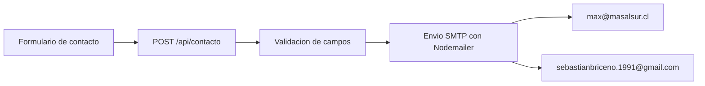

# Arquitectura Del Proyecto

Este proyecto es una aplicacion Next.js con App Router. La interfaz se organiza en `app/` para rutas y `components/` para componentes reutilizables. El contenido editable del sitio vive principalmente en archivos JSON dentro de `data/`, mientras que los tipos compartidos se declaran en `lib/types.ts`.

## Flujo De Contacto

El formulario de contacto esta implementado en `components/contacto/ContactForm.tsx` y envia los datos mediante `POST` a `/api/contacto`.

La ruta `app/api/contacto/route.ts` valida los campos principales del formulario y, si existe configuracion SMTP, envia el mensaje con Nodemailer. El destinatario principal para los mensajes del formulario es `max@masalsur.cl`, con copia a `sebastianbriceno.1991@gmail.com`.

Cuando el sitio se publica como frontend estatico en cPanel, el formulario no puede usar una API local del hosting. En ese caso el build debe definir `NEXT_PUBLIC_CONTACT_API_URL=https://masalsur.vercel.app/api/contacto` para mantener el envio por API en Vercel y evitar `mailto`.



## Configuracion De Correo

El envio real de correos depende de variables de entorno. En desarrollo o produccion se deben configurar:

```bash
SMTP_HOST=smtp.example.com
SMTP_PORT=587
SMTP_USER=tu@email.com
SMTP_PASS=tu_password_smtp
CONTACT_EMAIL_TO=max@masalsur.cl
CONTACT_EMAIL_CC=sebastianbriceno.1991@gmail.com
```

`CONTACT_EMAIL_TO` permite cambiar el destinatario principal sin tocar codigo. Si no se define, el endpoint usa `max@masalsur.cl` como valor por defecto. `CONTACT_EMAIL_CC` permite cambiar la copia del formulario; si no se define, el endpoint usa `sebastianbriceno.1991@gmail.com`.

## Deploy Hibrido cPanel + Vercel API

El proyecto mantiene dos modos de build:

- Vercel: `npm run build`. No define `NEXT_OUTPUT=export`, por lo que conserva `app/api/contacto/route.ts`.
- cPanel estatico: `npm run build:static`. Define `NEXT_OUTPUT=export` y `NEXT_PUBLIC_CONTACT_API_URL=https://masalsur.vercel.app/api/contacto`; el resultado queda en `out/` para comprimir y subir al hosting.

No se debe dejar `output: "export"` fijo en `next.config.mjs`, porque eso elimina el soporte de API Routes que necesita el correo.

La API de contacto incluye CORS para permitir peticiones desde `https://masalsur.cl` y `https://www.masalsur.cl` hacia `https://masalsur.vercel.app/api/contacto`.

## Validacion Del Formulario

Las reglas del formulario se centralizan en `lib/contactValidation.ts` para que el cliente y la API usen los mismos minimos y mensajes:

- Nombre: minimo 2 caracteres.
- Correo: formato de email valido.
- Mensaje / Sinopsis: minimo 10 caracteres.

El componente `components/contacto/ContactForm.tsx` muestra ayudas visibles por campo y, cuando la API responde con error, presenta el mensaje especifico devuelto por `/api/contacto`.

## Consideraciones

- `replyTo` se configura con el correo ingresado por la persona que envia el formulario, para responder directamente desde el cliente de correo.
- Si no hay SMTP configurado, el endpoint no envia correos y solo registra el formulario en consola para evitar fallos durante desarrollo.
- No se deben subir archivos `.env.local` al repositorio; `.gitignore` ya excluye esos archivos.
